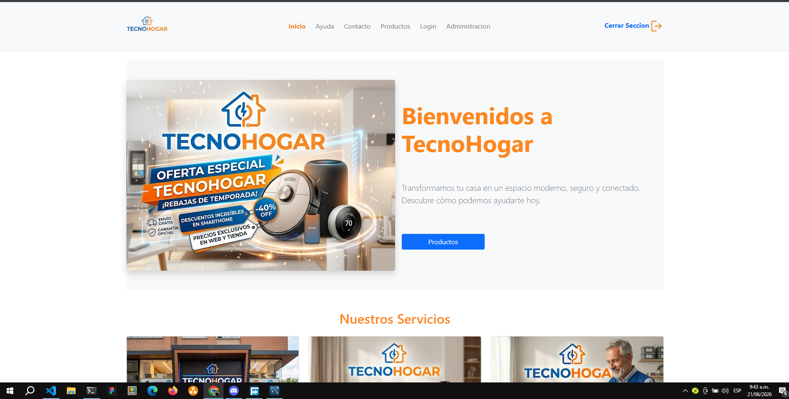
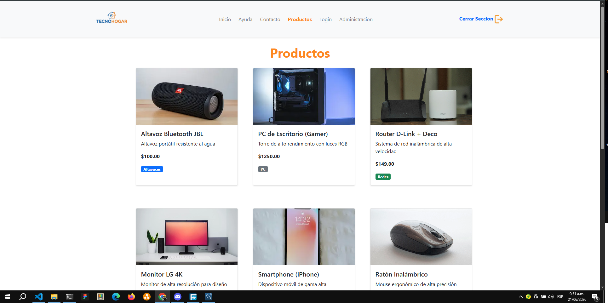
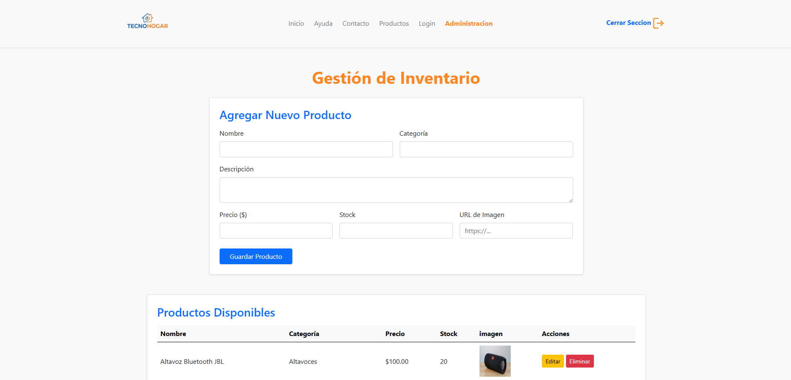
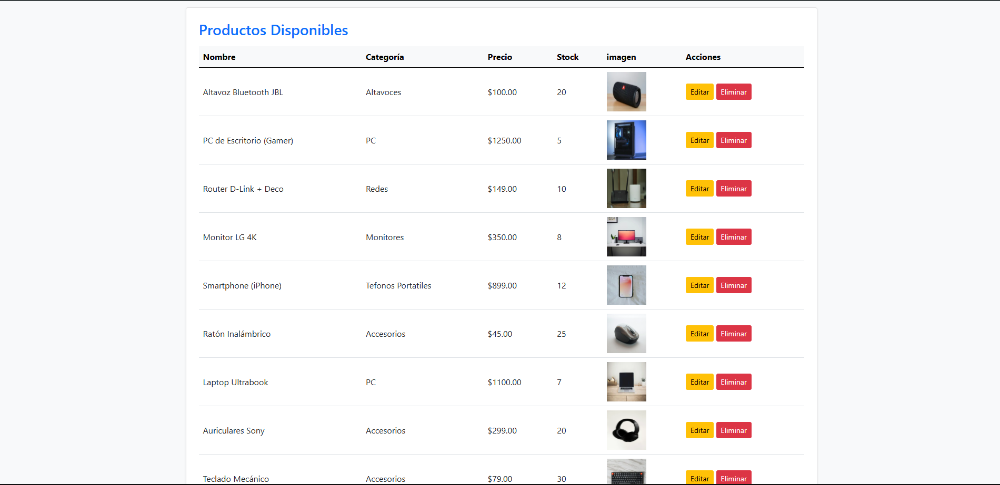
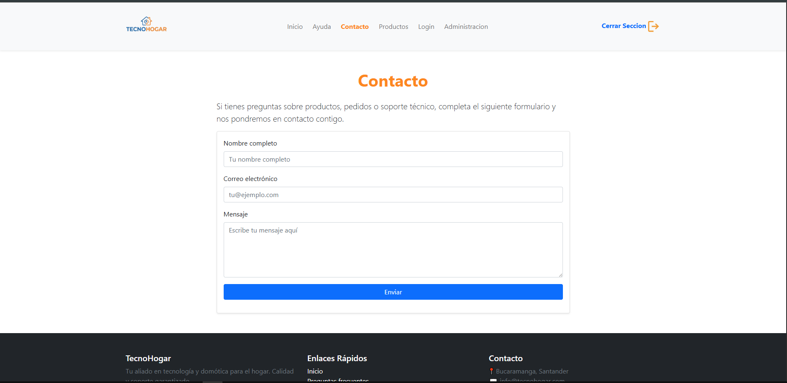
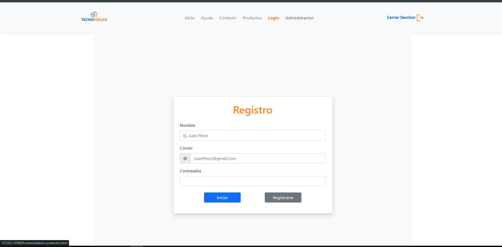

# Proyecto TecnoHogar

## Descripción general

TecnoHogar es una aplicación web educativa de tipo **full stack** creada para un taller práctico. El proyecto combina una interfaz frontend con un backend en Node.js y una base de datos MySQL.

El sitio permite a los usuarios explorar productos tecnológicos para el hogar, visitar páginas de ayuda y contacto, y ofrece un panel administrativo para gestionar el inventario de productos.

## Tecnologías utilizadas

- **HTML**: estructura de las páginas web.
- **CSS**: estilos personalizados en `frontend/css/estilos.css`.
- **Bootstrap 5**: diseño responsivo y componentes visuales mediante CDN.
- **JavaScript**: lógica del frontend y llamadas al servidor.
- **Node.js**: servidor backend.
- **Express**: framework para rutas y API REST.
- **MySQL**: base de datos relacional.
- **Fetch API**: comunicación entre frontend y backend en formato JSON.
- **CORS**: permite el intercambio de recursos entre el servidor y el frontend.

## Estructura del proyecto

- `frontend/`
  - `index.html`: página de inicio.
  - `ayuda.html`: página de ayuda.
  - `contacto.html`: formulario de contacto.
  - `productos.html`: listado visual de productos.
  - `admin-productos.html`: panel para agregar, editar y eliminar productos.
  - `css/estilos.css`: estilos personalizados.
  - `js/`: scripts de interacción.
  - `img/` y `video/`: recursos multimedia.

- `backend/`
  - `server.js`: servidor Express y conexión a MySQL.
  - `package.json`: dependencias del backend.

## Funcionalidades principales

- Navegación entre páginas de inicio, ayuda, contacto, productos y administración.
- Carga de productos desde la base de datos y visualización en tarjetas.
- Panel administrativo para:
  - agregar productos,
  - editar productos,
  - eliminar productos.
- Inicio de sesión con autenticación básica mediante correo y contraseña.
- Envío de datos de contacto al servidor para guardarlos en la base de datos.

## Flujo de datos

1. El usuario abre una página del frontend en el navegador.
2. El frontend usa JavaScript y Fetch API para comunicarse con el backend.
3. El backend en `backend/server.js` recibe la petición y consulta MySQL.
4. MySQL devuelve la información o guarda el registro.
5. El servidor responde con JSON y el frontend actualiza la interfaz.

## Rutas de backend destacadas

- `GET /productos`: devuelve la lista de productos.
- `POST /agregar`: crea un nuevo producto.
- `GET /administracion/productos`: obtiene productos para administración.
- `PUT /administracion/productos/:id`: actualiza un producto.
- `DELETE /eliminar/productos/:id`: elimina un producto.
- `POST /login`: valida credenciales de usuario.
- `POST /guardar`: guarda datos del formulario de contacto.

## Archivos JavaScript clave

- `frontend/js/productos.js`
  - carga y muestra productos en la página `productos.html`.
  - gestiona la administración de inventario en `admin-productos.html`.
- `frontend/js/login.js`
  - procesa el formulario de acceso.
  - administra el inicio y cierre de sesión.

## Cómo usar este documento

### Capturas de pantalla

### 1. Inicio

### 2. Productos

### 3. Administración de productos

### 4. Formulario de contacto

### 5. Formulario login

---

[def]: /frontend/img/PaginaInicio.png
